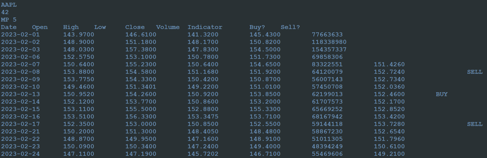

## About

This program utilizes the Alpha Vantage API to obtain past stock prices and uses this 
data to calculate some metrics summarizing those prices, and ultimately report on potentially opportune 
times to buy or sell the stock, based on one of a few automated buying-and-selling strategies. 

    

## Indicators

The core of the analysis will be comparing daily price and volume data against the values of 
indicators. There are three kinds of indicators used:

| Indicators            | Description                                                                                                                                                                                                                                                                                                                                             | 
| --------------------- | ------------------------------------------------------------------------------------------------------------------------------------------------------------------------------------------------------------------------------------------------------------------------------------------------------------------------------------------------------- |
| True range            | The range of prices (highest price minus lowest price) for the current day, including any movement since the previous day's close.                                                                                                                                                                                                                      |
| Simple moving average | The *N-day simple moving average* at the end of a particular day is the average of the most recent N closing prices. Days on which there is no trading are not counted.                                                                                                                                                                                 |
| Directional indicator | The *N-day directional indicator* for a stock is the number of closing prices out of the most recent N on which the stock's price went up (i.e., it closed at a higher price than the previous close) *minus* the number of days out of the most recent N on which the stock's price went down (i.e., closed at a lower price than the previous close). |

## Requirements 

This program requires an Aplha Vantage API key which can acquired [here](https://www.alphavantage.co/support/#api-key). Once API key is 
obtained, place the key in a file on a single line

## How to Run

 - `python main.py`

## Inputs Expected

1. The first line of input specifies the full path to a text file containing an Alpha Vantage API key
2. The second line of input specifies a partial URL for the Alpha Vantage API: `https://www.alphavantage.co`
3. The third line of input specifies the symbol associated with the stock, such as `AAPL` or `MSFT`
4. The fourth line of input specifies the *start date* for which an analysis is to be done. This will be a date in the format **YYYY-MM-DD**
5. The fifth line of input specifies the *end date* for which an analysis is to be done.
6. The sixth line of input specifies what combination of an indicator and a signal strategy will be used in the analysis.
    - **TR** means that the true range indicator will be used. This is followed by a space, followed by a buy threshold, followed by a space, followed by a sell threshold.
      Each threshold is described by either a < or a > character, followed by a percentage, which is a non-negative number (with optional decimal point and decimal places). 
      For example, **TR <1.5 >0.5** indicates that the true range indicator should be calculated, that a buy signal should be generated when the true range is less than 1.5%, 
      and that a sell signal should be generated when the true range is greater than 0.5%.
    - **MP** means that the simple moving average indicator will be calculated for the closing prices. This is followed by a space, followed by a number of days (i.e., the "N" value, 
      which you can assume is positive), followed by a space. A buy signal should be generated when the closing price crosses above the N-day simple moving average; a sell signal 
      should be generated when the closing price crosses below the N-day simple moving average. For example, **MP 50** means that we should determine the 50-day simple moving average, 
      then buy and/or sell when the price crosses above and/or below it
    - **MV** means the same thing as **MP**, except that we calculate the simple moving average of the volumes instead of the closing prices. For example, **MV 10** means that we should determine 
      the 10-day simple moving average of volumes, then buy and/or sell when the volume crosses above and/or below it.
    - **DP** means that the directional indicator will be calculated for the closing prices. This is followed by a space, followed by a number of days (i.e., the "N" value, which you can 
      assume is positive), followed by a space, followed by a buy threshold (which is always to be written with a sign unless it's 0, e.g., +5 and -5 are legal, but 5 is not), followed 
      by a space, followed by a sell threshold (which follows the same format rules as the buy threshold). For example, **DP 10 +5 -3** means that we should determine the 10-day directional 
      indicator, then buy when it crosses above +5 and sell when it crosses below -3.
    - **DV** means the same thing as **DP**, except that we use the volumes instead of the closing prices. For example, **DV 10 +5 -3** means that we should determine the 10-day directional indicator 
      of volumes, then buy and/or sell when the volume crosses above and/or below it.
